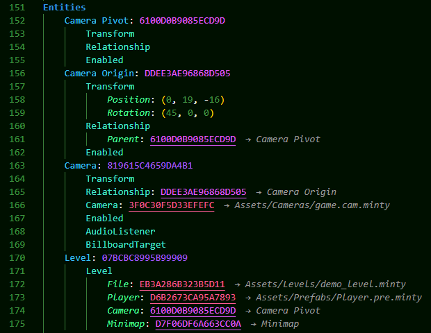

# Minty Support

The official support extension for VsCode for the [Minty](https://github.com/mtalyat/Minty) game engine.

## Features

- File navigation (ctrl+click a path to open the file).
- UUID navigation (ctrl+click a UUID to open its corresponding file).
- UUID generation/insertion (ctrl+alt+u, ctrl+alt+i).
- UUID lookup (ctrl+alt+u ctrl+alt+u) or asset path lookup (ctrl+alt+u ctrl+alt+y).
- Incremental UUID insertion (ctrl+alt+u ctrl+alt+n).
- Supports full (32 character) or short (16 character) UUIDs.
- Easily create new Asset files using the templates from your Minty directory, by right clicking on a directory within the explorer.
- Easily create meta files by right clicking a file within the explorer.
- Easily compile shader modules by right clicking a .glsl, .vert or .frag file within the explorer.

## Requirements

You must have [Minty](https://github.com/mtalyat/Minty) installed. Instructions for installation are in the project's README.

## Extension Settings

None.

## Known Issues

None.

## Release Notes

Check CHANGELOG.md for all changes.